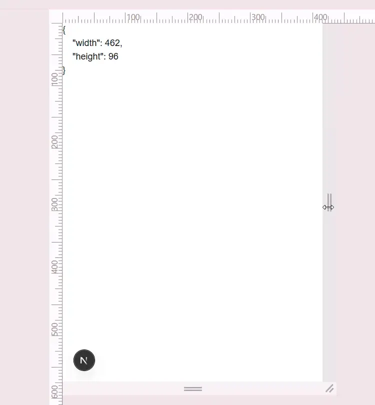

# next-node-event

意地でも useEffect を使わないサンプル

node のサイズ変更イベントを取得し、コンポーネントに反映させる方法を示します  
本来 useEffect でイベントを処理しますが、万能 hook の useSyncExternalStore で処理します  
そんなに useEffect のことが嫌いなら、いっそのこと完全にお別れしましょう



```tsx
"use client";
import { useRef, useSyncExternalStore } from "react";

export default function Page() {
  const storeCtx = useRef({
    subscribe: (onStoreChange: () => void) => {
      storeCtx.onStoreChange = onStoreChange;
      return () => {};
    },
    onStoreChange: () => {},
    ref: (node: HTMLDivElement | null) => {
      if (node) {
        storeCtx.subscribe = () => {
          const observer = new ResizeObserver(() => {
            storeCtx.data = {
              width: node.offsetWidth,
              height: node.offsetHeight,
            };
            storeCtx.onStoreChange();
          });
          observer.observe(node);
          return () => observer.disconnect();
        };
        storeCtx.data = {
          width: node.offsetWidth,
          height: node.offsetHeight,
        };
      }
    },
    data: { width: 0, height: 0 },
  }).current;
  const data = useSyncExternalStore(
    storeCtx.subscribe,
    () => storeCtx.data,
    () => storeCtx.data
  );
  return (
    <div className="whitespace-pre" ref={storeCtx.ref}>
      {JSON.stringify(data, null, 4)}
    </div>
  );
}
```
